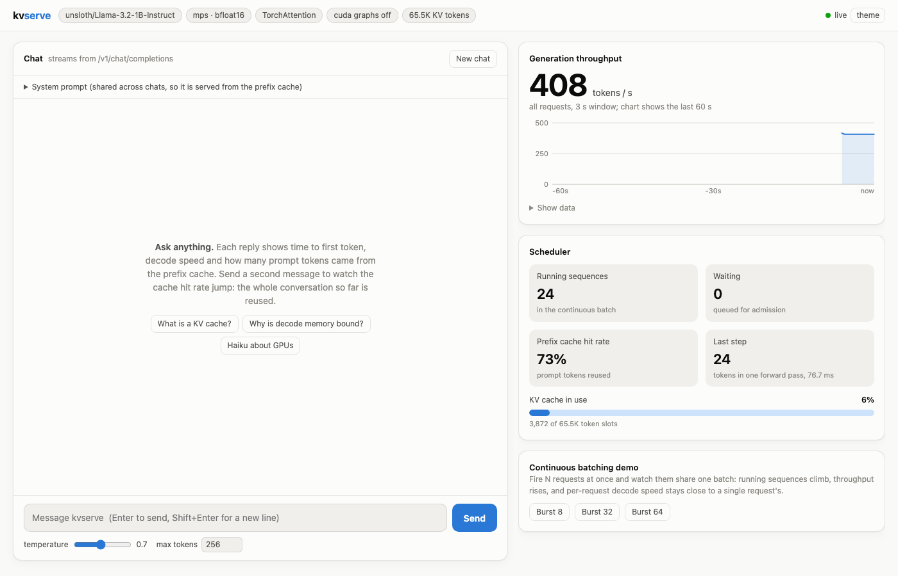

# kvserve

An LLM inference engine built from first principles: paged KV cache, continuous
batching with chunked prefill, prefix caching, recompute preemption, a Triton
paged-attention kernel, and an OpenAI-compatible streaming server with Prometheus
metrics. Benchmarked head-to-head against vLLM on the same GPU.

Every scheduling optimisation is verified to be **output-invariant**: generations are
token-for-token identical to Hugging Face `transformers` under batching, chunked
prefill, preemption and prefix caching.

## Architecture

```
 HTTP clients ──► FastAPI server (OpenAI API, SSE streaming, /metrics)
                        │  asyncio queues
                        ▼
                 AsyncLLMEngine ── dedicated engine thread (no locks on engine state)
                        │
                        ▼
                    LLMEngine: schedule ─► execute ─► sample ─► update
                     │                 │
          ┌──────────┘                 └──────────┐
          ▼                                       ▼
      Scheduler                              ModelRunner
  token budget per step,              flat (unpadded) token batch,
  decode-first, chunked prefill,      attention metadata, sampling
  recompute preemption                          │
          │                                     ▼
          ▼                              Llama model (fused QKV / gate-up)
   KVCacheManager                               │
  block allocator, block tables,                ▼
  ref counts, chained-hash             Paged attention backend
  prefix cache, LRU eviction           (Triton kernel on CUDA; torch reference)
```

### Key design decisions

| Decision | Why |
|---|---|
| One invariant, `num_computed_tokens < num_tokens`, drives scheduling | Prefill, chunked prefill, decode and post-preemption recompute are the same code path; no separate prefill phase |
| Per-step token budget, running sequences served first | Bounds step latency (protects TPOT of in-flight decodes) while new prompts fill leftover capacity |
| Fixed-size KV blocks + block tables | No contiguous allocation per sequence; waste is at most one partial block per sequence |
| Chained SHA-256 block hashes for prefix caching | A block hit implies the whole prefix matches; freed blocks stay cached until LRU eviction |
| Recompute (not swap) preemption | Simple and cheap with prefix caching; no CPU swap space to manage |
| Engine on its own thread, commands via queue | GPU work never blocks the event loop; engine state is single-threaded |
| Fused QKV and gate/up projections | Fewer, larger GEMMs: better hardware utilisation |

## Demo

`uv run kvserve serve`, then open **http://localhost:8000**: a chat UI plus a live view of
the engine.



- **Per-reply stats:** time to first token, decode tok/s, and how many prompt tokens
  came from the prefix cache. The second turn of a conversation typically reuses most of
  the prompt (e.g. 48 of 77 tokens, TTFT 241 ms -> 26 ms on the M5 Pro).
- **Live engine panel** (polls `/stats`): throughput over the last 60 s, running and
  waiting sequences, tokens in the last forward pass, KV cache usage, prefix-cache hit rate.
- **Continuous batching demo:** fire 8/32/64 concurrent requests and watch them share one
  batch; reports aggregate throughput, per-request decode speed and TTFT.

## Quickstart

```bash
uv sync
uv run kvserve serve --port 8000            # downloads Llama-3.2-1B-Instruct on first run
```

```bash
curl localhost:8000/v1/chat/completions -H 'content-type: application/json' \
  -d '{"messages":[{"role":"user","content":"What is a KV cache?"}],"max_tokens":64,"stream":true}'
```

Python:

```python
from kvserve import LLMEngine, EngineConfig, SamplingParams

engine = LLMEngine(EngineConfig())
print(engine.generate(["The capital of France is"], SamplingParams(temperature=0, max_tokens=16)))
```

Engine flags (`uv run kvserve serve --help`): `--block-size`, `--kv-cache-memory-gb`,
`--max-num-seqs`, `--max-num-batched-tokens`, `--max-model-len`,
`--no-enable-prefix-caching`, `--attention-backend auto|torch|triton`, `--device`, `--dtype`.

## Benchmarks

`bench/bench_serving.py` drives any OpenAI-compatible server (kvserve, vLLM, SGLang)
with fixed token-id prompts and `ignore_eos`, so results are directly comparable.
It reports TTFT, TPOT, inter-token latency, end-to-end latency, throughput and goodput
under latency SLOs.

```bash
uv run python bench/bench_serving.py --base-url http://localhost:8000 \
  --num-prompts 64 --input-len 256 --output-len 64
```

All GPU results: RTX 4090 (24 GB), Llama-3.2-1B-Instruct, bf16, block size 16. Raw data
in [`results/rtx4090/`](results/rtx4090).

### Paged attention kernel (decode)

`bench/bench_kernel.py`, 32 query / 8 KV heads, head_dim 64, L2 flushed before every
timed call, median of 50. Decode attention is memory bound, so achieved HBM bandwidth
against the 1008 GB/s peak is the figure of merit.

| Batch | Context | Triton | Torch reference | Speedup | Bandwidth | % of peak |
|---|---|---|---|---|---|---|
| 1 | 2048 | 0.108 ms | 0.224 ms | 2.1x | 39 GB/s | 4% |
| 8 | 2048 | 0.115 ms | 0.549 ms | 4.8x | 293 GB/s | 29% |
| 32 | 8192 | 0.649 ms | 6.670 ms | 10.3x | 827 GB/s | 82% |
| 64 | 8192 | 1.193 ms | 13.150 ms | 11.0x | **900 GB/s** | **89%** |
| 128 | 2048 | 0.634 ms | 6.859 ms | 10.8x | 847 GB/s | 84% |

Large batches run near the bandwidth roofline. Small batches are underutilised: the
grid is (sequences x KV heads), so batch 1 launches only 8 programs on a 128-SM GPU.
Split-KV (flash-decoding) is the planned fix.

### CUDA Graphs for decode

Decode was launch bound: ~300 small kernels per step issued from Python took ~10 ms
for ~2.5 ms of GPU work. Uniform decode steps now replay a CUDA graph captured per
padded batch size (`bench/bench_decode.py`, 512-token contexts):

| Batch | Eager | CUDA graph | Speedup | Decode tok/s |
|---|---|---|---|---|
| 1 | 11.90 ms | **3.95 ms** | 3.0x | 253 |
| 8 | 12.20 ms | 4.64 ms | 2.6x | 1,725 |
| 32 | 12.88 ms | 5.45 ms | 2.4x | 5,872 |
| 128 | 14.08 ms | 8.81 ms | 1.6x | **14,526** |

The remaining growth with batch size is per-step Python input preparation, which
scales with the number of sequences.

### Serving: kvserve vs. vLLM 0.30

`bench/compare_vllm.sh`: all systems on the same pod (RTX 4090, EPYC 7532), same model,
`max_num_seqs=128`, `max_num_batched_tokens=2048`, 8 GB KV cache, prefix caching on,
256 requests per scenario, fixed token-id prompts with `ignore_eos`. Goodput counts
requests meeting TTFT <= 1 s and TPOT <= 100 ms. "eager" is kvserve with
`--no-enable-cuda-graphs`.

| Scenario (in/out tokens) | System | Output tok/s | TTFT p50 / p99 (ms) | TPOT p50 / p99 (ms) | Goodput (req/s) |
|---|---|---|---|---|---|
| 512/128, 4 req/s | kvserve | 452 | 22 / 38 | **5.6** / 7.5 | 3.53 |
| | kvserve eager | 446 | 32 / 115 | 13.9 / 16.0 | 3.49 |
| | vLLM | 453 | 22 / 40 | 3.4 / 3.7 | 3.54 |
| 512/128, 8 req/s | kvserve | 893 | 22 / 40 | **6.2** / 9.3 | 6.98 |
| | kvserve eager | 866 | 35 / 58 | 15.6 / 19.4 | 6.77 |
| | vLLM | 901 | 19 / 26 | 3.4 / 3.7 | 7.04 |
| 512/128, 16 req/s | kvserve | 1696 | 54 / 117 | 16.4 / 22.9 | 13.25 |
| | kvserve eager | 1479 | 80 / 180 | 36.3 / 47.3 | 11.56 |
| | vLLM | 1771 | 21 / 35 | 3.6 / 3.9 | 13.84 |
| 512/128, 32 req/s | kvserve | 2149 | 507 / 3138 | 38.6 / 46.3 | 9.25 |
| | kvserve eager | 1638 | 1564 / 5757 | 51.0 / 55.4 | 5.80 |
| | vLLM | 3413 | 23 / 52 | 3.9 / 4.2 | 26.67 |
| 512/128, burst | kvserve | 2340 | 5595 / 11458 | 38.4 / 41.6 | 3.79 |
| | kvserve eager | 1822 | 7241 / 14673 | 50.3 / 54.1 | 2.89 |
| | vLLM | 6684 | 2412 / 4192 | 9.4 / 13.0 | 20.40 |
| 1024/128, 768 shared prefix, 16 req/s | kvserve | 1651 | 68 / 127 | 21.3 / 29.6 | 12.90 |
| | kvserve eager | 1447 | 92 / 245 | 42.7 / 54.2 | 11.30 |
| | vLLM | 1762 | 26 / 44 | 3.9 / 4.3 | 13.77 |

**Where kvserve stands:** at 4-16 req/s it delivers 96-100% of vLLM's goodput with
TTFT on par at low load; CUDA graphs cut TPOT 2.2-2.5x there. At saturation it reaches
35% of vLLM's peak throughput.

**Why the gap remains at high load (measured):** under heavy arrival, most steps mix
prefill chunks with decodes. Those steps cannot use the decode graphs and run eagerly,
so TPOT at 32 req/s (38.6 ms) sits near the eager step time. Next: piecewise graphs
(capture everything except attention, which works for mixed batches) and vectorised
input preparation.

**Host matters for a launch-bound engine:** eager kvserve reached 2656 tok/s on an EPYC
75F3 host and 1822 tok/s here with the same GPU model, so every comparison above is
from a single host. Earlier single-host results (EPYC 75F3, before CUDA graphs) are in
[`results/rtx4090/serving_kvserve_vs_vllm.jsonl`](results/rtx4090/serving_kvserve_vs_vllm.jsonl).

### Apple M5 Pro (MPS), development baseline

Torch reference attention, 64 concurrent requests:

| Workload | Prompt len | TTFT mean | TPOT mean | Output tok/s |
|---|---|---|---|---|
| Unique prompts | 256 | 1456 ms | 85 ms | 587 |
| 448-token shared prefix | 512 | **575 ms** | 118 ms | 511 |

Prefix caching cuts TTFT by 60% despite 2x longer prompts. Offline decode throughput
scales from 45 tok/s at batch 1 to 999 tok/s at batch 32 (22x) from continuous
batching alone.

### Reproducing on a GPU pod

```bash
scripts/sync_to_pod.sh root@<ip> <port>            # from your laptop
bash scripts/pod_setup.sh --vllm                   # on the pod
uv run pytest                                      # 61 tests incl. GPU kernel, CUDA graphs, e2e
uv run python bench/bench_decode.py                # eager vs CUDA graph decode step
uv run python bench/bench_kernel.py --peak-gbps 1008
bash bench/compare_vllm.sh
```

The pod needs an NVIDIA driver new enough for current vLLM wheels (CUDA 13 hosts);
kvserve itself pins CUDA 12.8 wheels and runs on driver 570+.

## Testing

```bash
uv run pytest -m "not slow"   # allocator, scheduler, invariants (seconds)
uv run pytest                 # + token-exact comparison against HF transformers
```

The slow suite asserts identical greedy output to `transformers` for: batched vs. single
requests, chunked prefill with a 3-token budget, heavy preemption with a 10-block pool,
and prefix-cache hits vs. a cold cache. On CUDA, the same comparison runs end to end
through the Triton kernel (fp32, IEEE dots). The kernel is also tested against the
torch reference on shuffled page layouts across decode, prefill, chunked prefill, mixed
batches, long contexts, GQA ratios, dtypes and head sizes. A randomized test checks
that the allocator never leaks or double-frees blocks.

## Roadmap

- [x] Paged KV cache, continuous batching, chunked prefill, preemption
- [x] Prefix caching (chained block hashes, LRU eviction)
- [x] OpenAI-compatible streaming server, Prometheus metrics, benchmark harness
- [x] Triton paged-attention kernel (mixed prefill/decode, GQA-aware), 89% of HBM peak
- [x] NVIDIA benchmarks vs. vLLM, with per-step profiling of the gap
- [x] CUDA Graphs for decode: 3.95 ms/step at batch 1 (3.0x), 96-100% of vLLM goodput at moderate load
- [ ] Piecewise CUDA graphs for mixed prefill/decode steps; vectorised input preparation
- [ ] Split-KV decode for small batches / long contexts
- [ ] Tensor parallelism (NCCL)
- [ ] Go gateway, KV-cache-aware router, disaggregated prefill/decode
- [ ] Speculative decoding, FP8 KV cache
